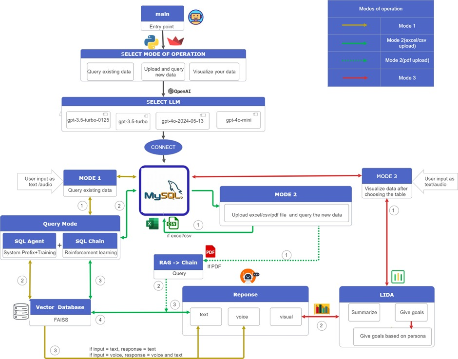
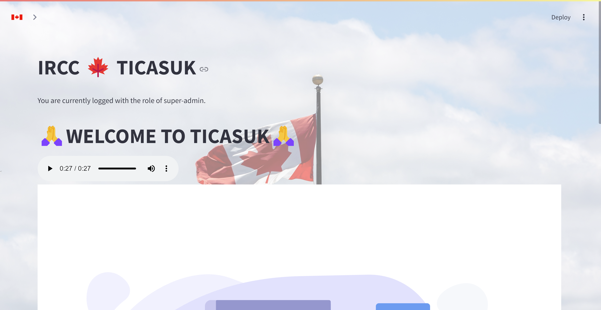
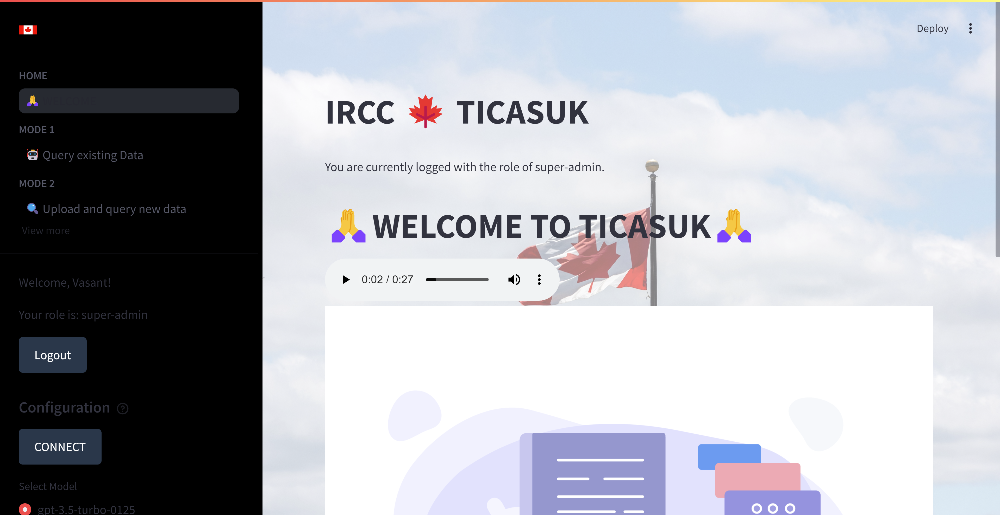
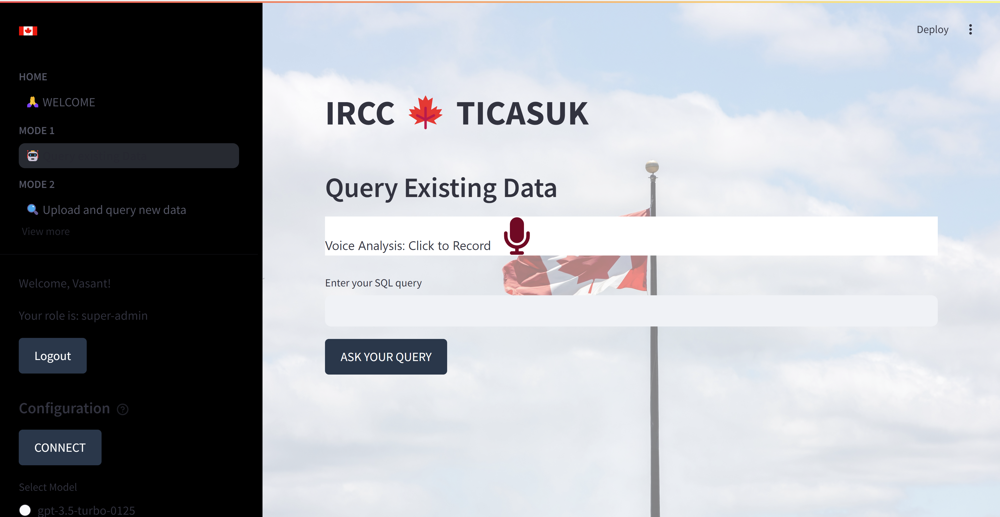
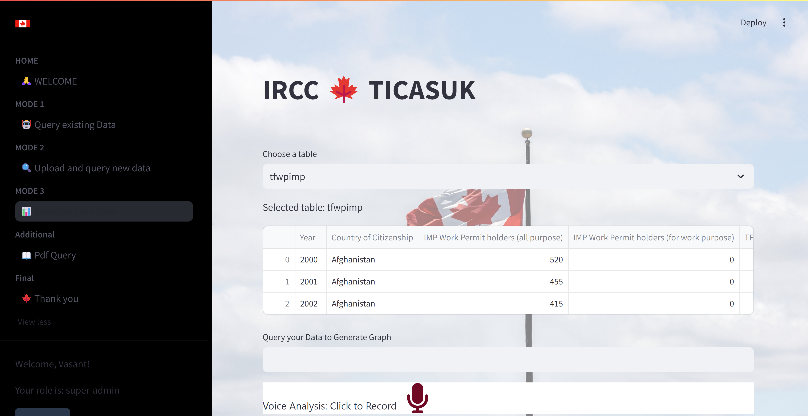

# Introduction

This chatbot is a user-centric platform that allows users to interact with and understand multiple datasets through an innovative, interactive interface by using different options. Using different LLMs and a robust database, the chatbot provides users with a versatile and user-friendly interface to manage and analyze data efficiently. This platform allows users to upload datasets of Immigration, Refugees and Citizenship Canada (IRCC) in excel, CSV or PDF format, enter natural language query related to it and retrieve precise information quickly in the form of voice or text. Also, they can visualize those results, and derive insights from data in an intuitive and accessible manner. Overall, it is a powerful tool designed to make data interaction more accessible, efficient, and insightful which processes the inputs and provides the responses through an intuitive interface, ensuring a seamless user experience.

# Architecture

Ticasuk is designed to offer a flexible and interactive interface for querying, uploading, and visualizing data. The architecture is structured around three main modes of operation, all of which are supported by a connection to a MySQL database (or any other database based on requirement) and various Large Language Models (LLMs). The system's flow and components are organized to give information to users through their interactions with the chatbot.

**Entry Point:** The entry point of the application is the main component where users initiate their interaction. From there, users are prompted to select a mode of operation.

**Mode Selection:** Users can choose between three modes of operation:  
Mode 1: Query Existing Data  
Mode 2: Upload and Query New Data (Excel/CSV or PDF upload)  
Mode 3: Visualize Your Data

**LLM Selection:** After selecting a mode, users choose Large Language Model (LLM) for processing their requests. Available LLM options include:  
gpt-3.5-turbo-0125  
gpt-3.5-turbo  
gpt-4o-2024-05-13  
gpt-4o-mini

**Database Connection:** Once an LLM is selected, the system establishes a connection to the database, which serves as the backbone for data operations.

**Modes of Operation**  
Mode 1: Query Existing Data  
In this mode, the system utilizes a combination of a SQL Agent and SQL Chain for querying existing data in the MySQL database.  
SQL Agent is responsible for setting system prefixes and training, while SQL Chain employs reinforcement learning techniques to refine the query process.  
The query results are fetched from the MySQL database and, if necessary, enhanced using a Vector Database (FAISS) to provide relevant information.  
The response to the user is generated based on the input type (text or audio), delivering text or voice output as needed.

Mode 2: Upload and Query New Data  
This mode allows users to upload new data in Excel, CSV, or PDF formats.  
For Excel/CSV uploads, the data is directly queried from the MySQL database.  
For PDF uploads, the system uses RAG -> Chain to process and query the new data.  
The mechanism for querying the uploaded data follows a similar process as in Mode 1, ensuring seamless integration with the existing datasets.

Mode 3: Visualize Your Data  
This mode provides users with tools to visualize their data after selecting a table from the database.  
The visualization process is facilitated by LIDA (a tool that uses LLMs for automatic generation of Grammar-Agnostic Visualizations and Infographics). 

LIDA offers functionalities such as:  
Summarization: Providing a concise overview of the data.  
Goal Setting: Suggesting objectives based on the data, which can be further refined based on user personas.

The system can deliver the visualization as text, voice, or visual output depending on user input.

**Response Generation:** The system generates responses in different formats (text, voice, or visual) based on the input type:  
If the input is text, the response is in text format.  
If the input is voice, the response includes both voice and text.  
Visual responses are provided when appropriate, such as in data visualization.

# User guide

**Getting Started**  
  
Initiate Interaction: Begin by interacting with the main component of the chatbot. This is your entry point into the system.

**Selecting a Mode of Operation**  
  
Once you start, you’ll be prompted to choose one of the following modes:

Mode 1: Query Existing Data  
Mode 2: Upload and Query New Data  
Mode 3: Visualize Your Data

**Mode Details**  
***Mode 1: Query Existing Data***  
  
***Steps:***  
Select Mode 1: Choose the option to query existing data.  
Choose LLM: Select from the available Large Language Models (LLMs) for query processing:  
gpt-3.5-turbo-0125  
gpt-3.5-turbo  
gpt-4o-2024-05-13  
gpt-4o-mini  
Input Query: Enter your SQL query or data request.  
Receive Results: The system utilizes the SQL Agent and SQL Chain, along with reinforcement learning, to process your query and retrieve the relevant data from the MySQL database.

***Mode 2: Upload and Query New Data***  
  
***Steps:***  
Select Mode 2: Choose the option to upload and query new data.  
Upload Data: Upload your data files in Excel, CSV, or PDF format.  
If Excel or CSV, the data is directly queried from the MySQL database.  
If PDF, the system processes the data using RAG -> Chain before querying.  
Choose LLM: Select an LLM for processing your queries.  
Query New Data: Formulate your query based on the newly uploaded data.  
Receive Results: Results are generated and provided based on the data you uploaded, using the appropriate processing mechanisms.

***Mode 3: Visualize Your Data***  
  
***Steps:***  
Select Mode 3: Choose the option to visualize your data.  
Choose Table: Select the table you wish to visualize from the MySQL database and enter the query.  
Summarization: Get a concise overview of data in a table.  
Goal Setting: Receive suggestions for objectives based on user personas. You can refine these suggestions further to align with specific goals.  
Receive Visualizations: The visual representations, including infographics, are automatically generated based on your data.

**Tips for Effective Use**  
***Get help:*** Use "Get help" option to get the detailed steps regarding the usage of this chatbot if you are using it for the first time.  
***Be Specific:*** Provide clear and specific queries or data files to get the most accurate results. Mention the table name in the query from which data needs to be acquired.  
***Choose the Right LLM:*** Select the LLM that best suits your needs for querying or data visualization. Also, refresh the chatbot before entering any new query.  
***Explore Visualizations:*** Use the visualization mode to gain insights through graphical representations of your data.

**Troubleshooting**  
***Data Not Found:*** Ensure that your queries are correct and that the data exists in the database or file you are using.  
***Upload Issues:*** Check the file format and ensure it is properly formatted as Excel, CSV or PDF.
***Visualization Problems:*** Verify that the table selection and data inputs are accurate.

Feel free to reach out if you need further assistance or have any questions about using the OpenData Chatbot. Happy data exploring!